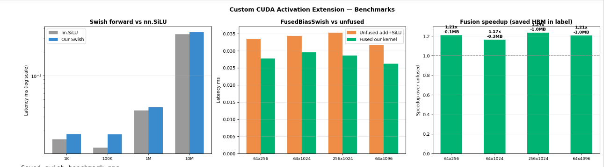

# Custom PyTorch CUDA Extension — Swish + Mish + Fused Bias+Swish

[](https://colab.research.google.com/github/YOUR_USERNAME/cuda-swish-ext/blob/main/Project4_SwishExtension.ipynb)


> A `pip install`-able PyTorch CUDA extension implementing Swish, Mish,
> and a fused Bias+Swish operator — complete with hand-written CUDA
> backward passes and `torch.autograd.gradcheck` verification.

---

## Install

```bash
pip install git+https://github.com/YOUR_USERNAME/cuda-swish-ext.git

# or in editable mode:
git clone https://github.com/YOUR_USERNAME/cuda-swish-ext
cd cuda-swish-ext && pip install -e .
```

## Usage

```python
import torch
from swish import Swish, Mish, FusedBiasSwish

# Drop-in replacement for nn.SiLU:
model = torch.nn.Sequential(
    torch.nn.Linear(512, 512),
    Swish(),          # our custom CUDA kernel
    torch.nn.Linear(512, 10)
).cuda()

x   = torch.randn(32, 512, device='cuda', requires_grad=True)
out = model(x)
out.sum().backward()   # backward uses our hand-written CUDA kernel

# Fused bias + Swish (one kernel instead of two):
act = FusedBiasSwish(num_features=512).cuda()
z   = torch.nn.functional.linear(x, weight)  # bias=False matmul
out = act(z)    # swish(z + bias) — fused in one CUDA kernel
```

---

## What's implemented

### 5 CUDA kernels in `swish_cuda.cu`

| Kernel | Formula | Key detail |
|--------|---------|------------|
| `swish_fwd` | `x * σ(x)` | Templated `float32 + float16` |
| `swish_bwd` | `σ(x) + swish(x)*(1-σ(x))` | Computes from `x` only — saves one HBM read |
| `mish_fwd` | `x * tanh(ln(1+eˣ))` | Numerically stable softplus |
| `mish_bwd` | `tanh(sp) + x*sech²(sp)*σ(x)` | Recomputes `sp` from `x` in register |
| `fused_bias_swish_fwd/bwd` | `swish(x + bias)` | Bias add fused into activation — 25% fewer HBM trips |
| `swish_vec4` | same | `float4` vector loads: 4 floats per 128-bit transaction |

### Fusion benefit

Standard PyTorch `F.silu(x + bias)`:
```
kernel 1: z = x + bias      reads x, bias    writes z to HBM
kernel 2: y = silu(z)        reads z          writes y to HBM
                              ── 4 HBM transactions ──
```

Our fused kernel:
```
kernel 1: y = swish(x+bias)  reads x, bias    writes y to HBM
                              ── 3 HBM transactions (25% fewer) ──
```

### Backward formula derivation

**Swish** `f(x) = x · σ(x)`:
```
f'(x) = σ(x) + x · σ(x) · (1 - σ(x))
      = σ(x) · (1 + x · (1 - σ(x)))
```

**Mish** `f(x) = x · tanh(softplus(x))`:
```
f'(x) = tanh(sp) + x · sech²(sp) · σ(x)
where sp = softplus(x) = ln(1 + eˣ)
```

Both are computed from `x` alone in a single pass — no intermediate values saved.

---

## Benchmarks



*(Run Cell 10 in the Colab notebook to reproduce)*

---

## Tests

```bash
python test_swish.py          # 10 correctness tests + 7 benchmarks
python test_swish.py --quick  # tests + short benchmarks (~30 seconds)
python test_swish.py --tests-only  # tests only, no benchmarks
```

Test coverage:
- Numerical correctness vs PyTorch at float32 and float16
- Boundary values: `x ∈ {-100, -10, 0, 10, 100}`
- Shape invariance: 1D, 2D, 3D, 4D tensors
- `torch.autograd.gradcheck` for Swish, Mish, and FusedBiasSwish (tests `grad_x` and `grad_bias`)
- Full training loop: MLP with our Swish converges identically to `nn.SiLU`
- Gradient flows to both weight matrix and fused bias
  
---

## Files

| File | Purpose |
|------|---------|
| `swish_cuda.cu` | All CUDA kernels + C++ launcher functions |
| `swish_cuda.cpp` | pybind11 binding + input validation |
| `swish.py` | `autograd.Function`, `nn.Module`, functional API |
| `test_swish.py` | 10 correctness tests + 7 benchmarks |
| `setup.py` | Build config — auto-detects GPU arch |
| `Project4_SwishExtension.ipynb` | Complete Colab notebook |

## Tech stack
- **Language:** CUDA C++ (C++17), Python 3
- **Build:** `torch.utils.cpp_extension`, Ninja
- **Testing:** `torch.autograd.gradcheck`, custom benchmark harness
- **GPU:** NVIDIA T4 (Turing, sm_75)
